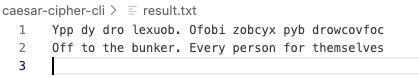

## Week7: Creating Command Line Tools

CREDIT/Note: Forked from the Data Engineering course repo maintained by Professor Noah Gift.

In this project, I create additional command line tool (CLT) to the encryption project located in the caeser-cipher-cli directory.

The original code was built to print encryption and decryption reuslts into the terminal. Optional --output CLT is now added so that encryption and decryption results are captured in a textfile. 

To encrypt a message using a specified shift value and capture the result to a file , please run the following: 
   cargo run --  --message "Here goes your message to excrypt" --encrypt --shift 10 --output result.txt

   -- message : use this required flag to pass your message to encrypt

   -- encrypt : use this flag to encrypt the message

   -- shift : use this optional flag to pass the the shift amount
   
   -- output : use this optional flag to capture the result of the encryption into a textfile

         - specify the name of the file you want to create and capture the results to

         - in this example, we use result.txt

         - program is designed to check if the file already exists in the current directory

         - if the file doesn't exists, it creates a file in the current directoty

         - if the file already exists, it appends the result to the existing file

         - image below shows how the content of this file might look like: 

   

To encrypt a message using a specified shift value and capture the result to a file , please run the following: 
   cargo run --  --message "Here goes your message to decypt" --decrypt --shift 10 --output result.txt

   Flags have the same meaning as the encrypt flag.

   

